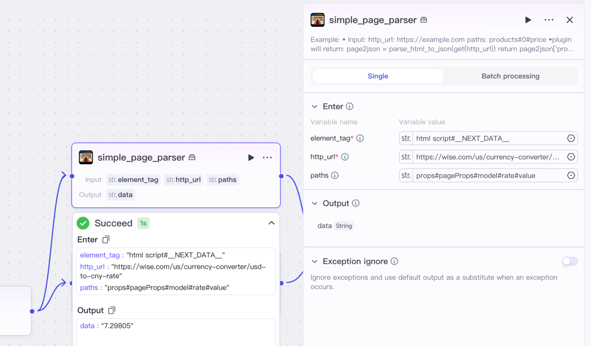

# 🌐 HWS Web Scraper Plugin

This plugin allows you to extract **specific values** from structured JSON embedded in webpages, such as exchange rates or product data.

---

## 🔧 How It Works

1. **Input a URL**  
   The plugin fetches the webpage using the provided URL.

2. **Parse JSON from HTML**  
   It extracts JSON from the `<script id="__NEXT_DATA__">` tag using BeautifulSoup.

3. **Specify a JSON path**  
   Provide a `#`-separated path to locate the desired value inside the JSON structure.

4. **Return the result**  
   The plugin returns the value found at that path.

## try on coze


---

## 📥 Example Input

```json
{
  "http_url": "https://wise.com/us/currency-converter/usd-to-cny-rate",
  "paths": "props#pageProps#model#rate#value"
}
```

## 📤 Example Output
```json
{
  "result": "7.25725"
}
```
## 🧭 Path Syntax
Use # to navigate through keys and array indexes:


|**Path**|**Meaning**|
|---|---|
|data#products#0#price|json['data']['products'][0]['price']|
|a#b#1#c|json['a']['b'][1]['c']|
Note: Array indexes must be digits (e.g., "0", "1").

## ✅ Requirements

- requests, 
- beautifulsoup4